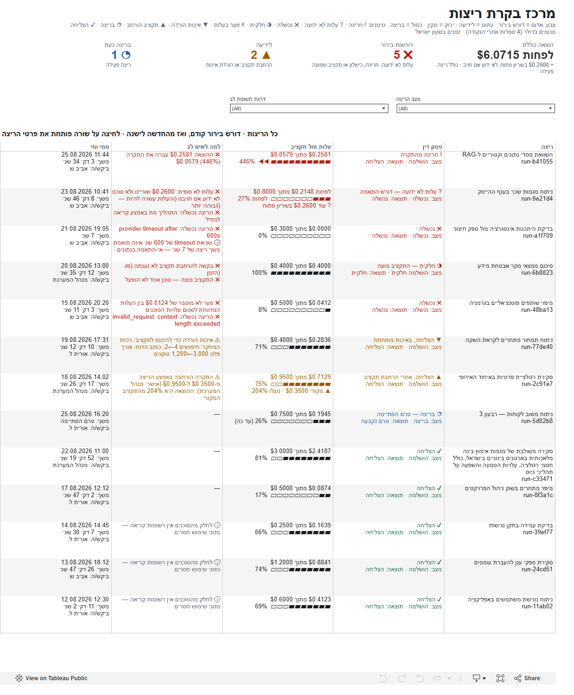
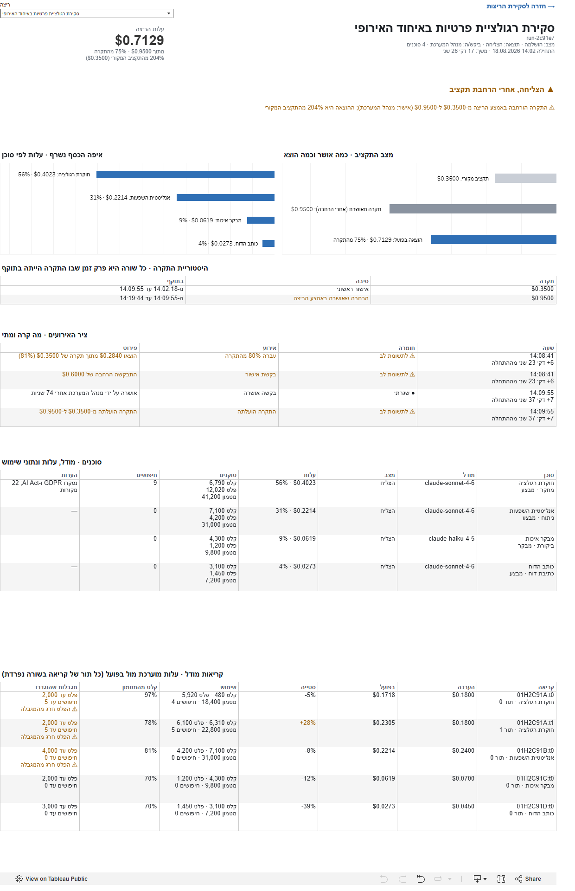
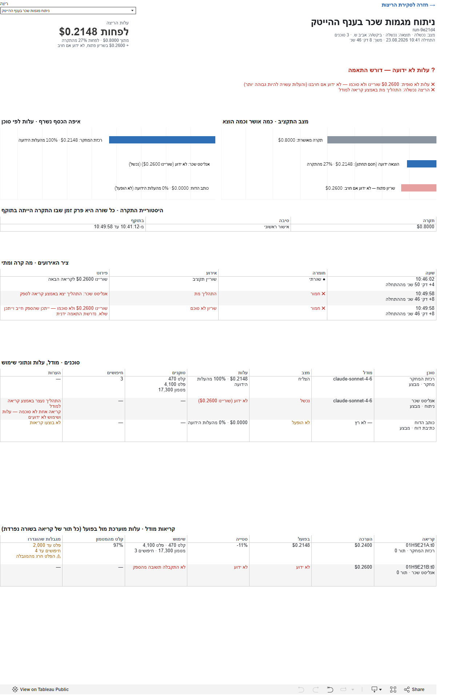
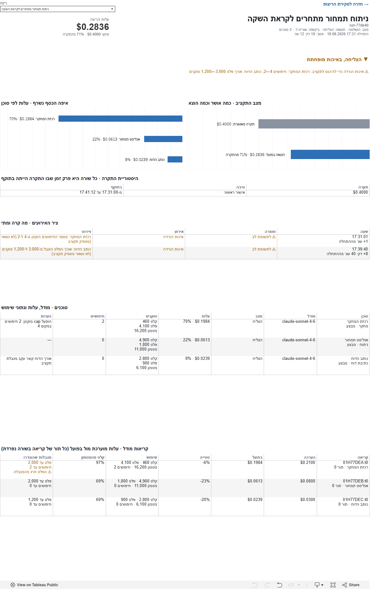
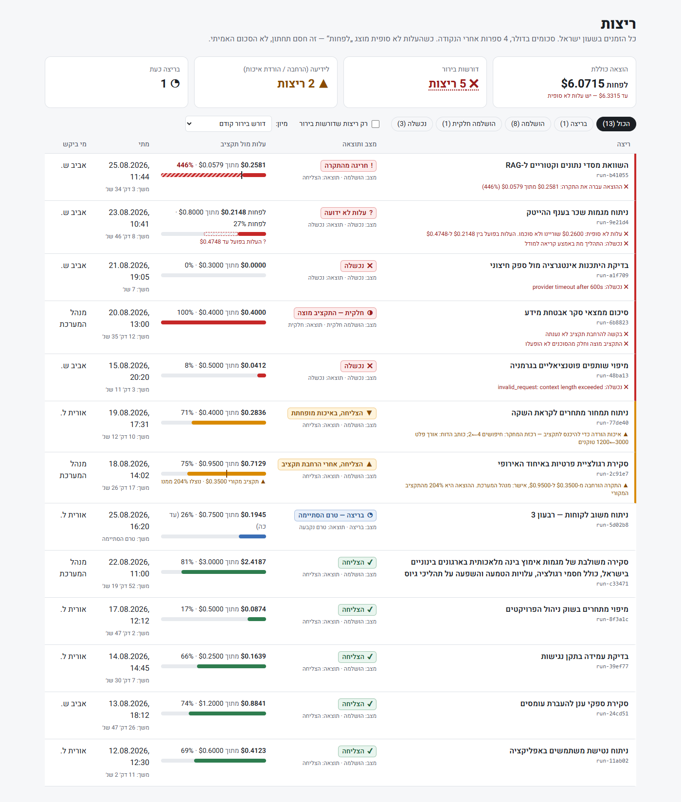
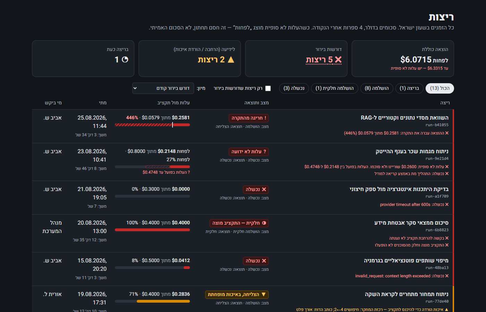
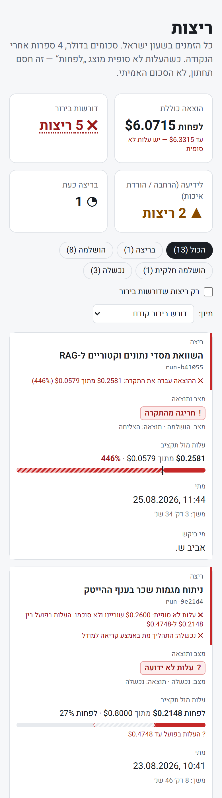
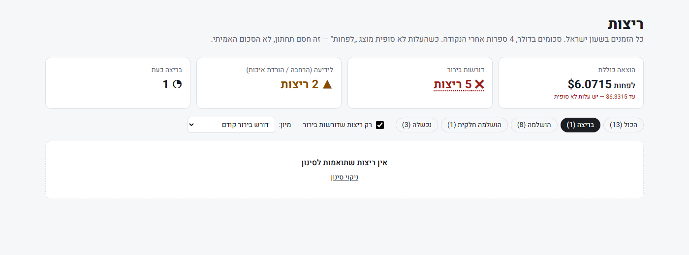

<div dir="rtl">

# מרכז בקרת ריצות — הארה

דשבורד בעברית שעונה על השאלות של מנהל: הריצה הצליחה? עלתה כמה שציפינו? ויתרנו על איכות בדרך?
מישהו אישר תקציב נוסף? איפה הכסף נשרף? ומה דורש בירור אנושי לפני שממשיכים?

| | |
|---|---|
| **דשבורד חי (Tableau Public)** | [public.tableau.com/app/profile/miri.weg/viz/hara-runs-dashboard_17905059120500](https://public.tableau.com/app/profile/miri.weg/viz/hara-runs-dashboard_17905059120500/sheet0) |
| **קישור ישיר לריצה מסוימת** | [פרטי `run-2c91e7`](https://public.tableau.com/views/hara-runs-dashboard_17905059120500/sheet1?%D7%A8%D7%99%D7%A6%D7%94=run-2c91e7) (הפרמטר `ריצה` בכתובת) |
| **קובץ העבודה** | [`tableau/hara-runs.twbx`](tableau/hara-runs.twbx) — כולל את הנתונים, נפתח ב-Tableau Desktop / Public 2026.2 ומעלה |
| **דוגמת React + TypeScript** | [`react-runs-table/`](react-runs-table/) |
| **הכנת הנתונים + בדיקות** | [`prep/`](prep/) |



---

## תוכן

1. [איך מריצים](#איך-מריצים)
2. [מבנה ה-repo](#מבנה-ה-repo)
3. [למה Tableau](#למה-tableau)
4. [החלטות העיצוב המרכזיות](#החלטות-העיצוב-המרכזיות)
5. [שני המסכים והמעבר ביניהם](#שני-המסכים-והמעבר-ביניהם)
6. [תשובות לשאלות מהסבב הקודם](#תשובות-לשאלות-מהסבב-הקודם)
7. [דוגמת React + TypeScript](#דוגמת-react--typescript)
8. [איך בדקתי](#איך-בדקתי)
9. [ממצאים בנתונים](#ממצאים-בנתונים)
10. [מה לא הושלם ולמה](#מה-לא-הושלם-ולמה)
11. [שימוש ב-AI](#שימוש-ב-ai)
12. [צילומי מסך](#צילומי-מסך)

---

## איך מריצים

**לצפייה:** דרך הקישור ל-Tableau Public, או לפתוח את `tableau/hara-runs.twbx` ב-Tableau Desktop / Tableau Public Desktop.

**בנייה מחדש של הדשבורד מהנתונים** (Python 3.12):

```bash
pip install tableauhyperapi pytest tzdata
python -m pytest prep -q              # 84 בדיקות
python prep/hara_prep.py              # data/*.json  →  tableau/data/*.csv
python tableau/build_workbook.py      # CSV  →  extracts (.hyper) + hara-runs.twb + hara-runs.twbx
```

(`tzdata` נחוץ ב-Windows, שאין בו מסד אזורי זמן מובנה עבור `Asia/Jerusalem`.)

**דוגמת ה-React** (Node 20 ומעלה):

```bash
cd react-runs-table
npm install
npm test          # Vitest + Testing Library — 72 בדיקות
npm run dev       # http://localhost:3000
```

## מבנה ה-repo

```
data/                     הנתונים כפי שהתקבלו (runs.json, runs/*.json, DATA-CONTRACT.md). מקור האמת היחיד
prep/
  hara_prep.py            JSON → טבלאות: כסף מדויק, פסק דין לכל ריצה, זמנים בשעון ישראל
  tableau_views.py        טבלאות תצוגה ל-Tableau: סדר עמודות RTL, טקסטים, מצבי ריק, הטמעת RTL
  test_*.py               84 בדיקות pytest
tableau/
  build_workbook.py       מייצר את קובץ ה-Tableau מקוד: גיליונות, צבעים, פעולות, פריסה
  hara-runs.twbx          קובץ העבודה הארוז (כולל נתונים)
  data/*.csv              הטבלאות ש-prep מייצר
react-runs-table/         Next.js 15 + React 19 + TypeScript + Tailwind: קומפוננטת טבלת הריצות
docs/screenshots/         צילומי מסך (Tableau: מהגרסה שפורסמה)
docs/brief.html           הבריף המקורי
```

## למה Tableau

- הבריף מדגיש **עיצוב מידע**: מה להראות, מה להבליט ומה להסתיר. Tableau מאפשר לבנות מסך קריאה-בלבד
  ולהתמקד בהחלטות ולא בתשתית.
- קישור ציבורי שנפתח בדפדפן, בלי להתקין כלום.
- המחיר, בכנות: ל-Tableau **אין RTL מובנה**, והוא לא מחשב כסף כמחרוזת עשרונית. את שתי הבעיות פתרתי
  במפורש (החלטות 3 ו-4). מכיוון שאצלכם עובדים ב-React + TypeScript, צירפתי גם
  [מימוש של טבלת הריצות בסטאק שלכם](#דוגמת-react--typescript), עם אותם כללי פסק דין.

**הדשבורד נבנה מקוד.** `tableau/build_workbook.py` מייצר את קובץ ה-Tableau: כל גיליון, צבע, מסנן, פעולה
ומיקום מוגדרים בקוד. כל שינוי נראה ב-diff, אפשר לבנות מחדש כשהנתונים משתנים, וכל הלוגיקה (כסף, פסקי
דין, טקסטים) נבדקת ב-pytest לפני שהיא מגיעה ל-Tableau. ל-Tableau נשארת רק הפריסה.

## החלטות העיצוב המרכזיות

### 1. "פסק דין" אחד לכל ריצה, לפני כל מספר

`status` ו-`outcome` לא עונים לבד על "הריצה הזו בסדר?". ריצה יכולה להיות `completed` + `succeeded`
ועדיין לחרוג פי 4.5 מהתקציב. לכן כל ריצה מקבלת **פסק דין** אחד שמשלב מצב, תוצאה, תקציב ואירועים.
הכלל הראשון שמתאים קובע:

| # | פסק דין | מתי | דרגה |
|---|---|---|---|
| 1 | ○ ממתינה | `status = pending` | בתהליך |
| 2 | ? עלות לא ידועה | `cost_is_complete = false`, שריון שלא סוכם, או קריאה לא מסוכמת בריצה שהסתיימה | דורש בירור |
| 3 | ! חריגה מהתקרה | ההוצאה גבוהה מהתקרה, או אירוע `budget_overrun_detected` (נבדק **לפני** "בריצה") | דורש בירור |
| 4 | ◔ בריצה | `status = running` | בתהליך |
| 5 | ✖ נכשלה | `status` **או** `outcome` = `failed` | דורש בירור |
| 6 | ◑ חלקית | `status` או `outcome` = `partial`, או שהתקציב מוצה | דורש בירור |
| 7 | ≠ פער בעלות | `spent_usd` שונה מסכום עלויות הסוכנים | דורש בירור |
| 8 | ! דורש בירור | בקשת הרחבה נדחתה | דורש בירור |
| 9 | ? תוצאה לא ידועה | הסתיימה בלי `outcome = succeeded` | לידיעה |
| 10 | ▼ איכות מופחתת | הצליחה, אבל הייתה הורדת איכות (`execution_cap_downgraded`) | לידיעה |
| 11 | ▲ אחרי הרחבת תקציב | הצליחה, אבל התקרה הורחבה באמצע | לידיעה |
| 12 | ✔ הצליחה | כל השאר | תקין |

לצד פסק הדין מופיעות **כל הסיבות** במילים, ולכל סיבה דרגה משלה: ✖ דורש בירור · ⚠ לידיעה · ⓘ מידע.
הרשימה ממוינת לפי דרגה (דורש בירור, לידיעה, בתהליך, תקין) ובתוך כל דרגה מהחדשה לישנה. `status`
ו-`outcome` המקוריים מוצגים מתחת לפסק הדין, כך שהמידע הגולמי לא מוסתר.

### 2. צבע הוא אף פעם לא המידע היחיד

כל פסק דין מוצג באייקון, במילים ובצבע, ומקרא בראש המסך מסביר את כולם. מי שלא מבחין בין אדום לירוק
מקבל את אותו מידע מהאייקון ומהמילה. כל אחוז וכל סכום כתובים בטקסט, והפסים הגרפיים רק חוזרים עליהם.

### 3. כסף: מדויק, אחיד, ולא יותר בטוח ממה שהמערכת יודעת

- **חישוב:** שדות `_usd` מפורסרים כ-`Decimal` (Python) או כ-`bigint` (TypeScript) ונשמרים כ**מספר שלם
  של מיקרו-דולרים**. סכימה של מספרים שלמים מדויקת, כך שגם Tableau סוכם בלי לאבד דיוק. חילוק ב-10⁶
  קורה רק כדי לצייר צירים.
- **תצוגה:** פורמט אחד בכל מקום: `$0.7129`, ארבע ספרות אחרי הנקודה, עיגול half-up. פער שמתעגל ל-$0.0000
  מוצג בשש ספרות.
- **עלות לא סופית** (`cost_is_complete: false`): מוצגת כ"לפחות $0.2148", ולצדה **השריון הפתוח**: "עוד $0.2600
  בשריון פתוח — לא ידוע אם חויב". בכוונה **אין "עד"**: שריון הוא הערכה ולא תקרה. ב-`run-b41055` העלות
  בפועל הייתה פי 5 מההערכה, ולכן "עד $0.4748" היה מבטיח ביטחון שאין למערכת. גם הסה"כ בראש המסך מסומן
  "לפחות", וגם כשיש ריצה פעילה.
- **חריגה לא נחתכת ב-100%:** ‏446% מוצג כ-446%. במד (▰▱) מופיע ◀◀ כשעוברים את התקרה.
- **המילה "לפחות" ולא הסימן ≥:** בטקסט RTL הדפדפן "משקף" את ≥ ומציג אותו כ-≤, כלומר הפוך מהמשמעות.

### 4. RTL מלא, גם ב-Tableau וגם בדפדפן

- **טבלאות מימין לשמאל:** ל-Tableau אין מצב RTL. כותרות שורה תמיד משמאל ועמודות רצות משמאל לימין.
  לכן כל טבלה נבנית מטבלת "תאים" ארוכה, שבה העמודה הראשונה בקריאה מקבלת את המיקום הימני ביותר.
  כותרות העזר מוסתרות.
- **Tableau בדפדפן מצייר כל טקסט כפסקה משמאל לימין,** בשונה מ-Desktop. זה הגורם ל-"ל-RAG" שקופץ לתחילת
  השורה ולאייקון שעובר לצד הלא נכון. גיליתי את זה רק אחרי הפרסום. הפתרון: כל שורת טקסט עטופה
  ב-RTL embedding (U+202B…U+202C) בשכבת הנתונים ובכל הכותרות הקבועות, עם בדיקות.
- **מזהים טכניים ומספרים עם סימן** (`run-2c91e7`, `claude-sonnet-4-6`, `+28%`, `+6 דק׳`, תאריך ושעה) עטופים
  בבידוד LTR (U+2066…U+2069 ב-Tableau, `<bdi dir="ltr">` ב-React), כך שלא מתפרקים בתוך משפט עברי.
- **טווחי זמן** כתובים במילים ("מ-14:02 עד 14:09") ולא עם חץ, כי חץ בין שני מספרים מתהפך ב-RTL.
- **שעון ישראל:** כל הזמנים מוצגים בשעון ישראל (`18.08.2026 14:02`), כי המקור ב-UTC. המיון עצמו לפי UTC.
- **פסי הגרף** (תקציב, עלות לפי סוכן) משתמשים בציר הפוך ולכן גדלים מימין לשמאל.
- **tooltip** בעברית שמציג את כל הטקסט של התא, במקום רשימת השדות הגולמית של Tableau.

### 5. גרף תקציב שעובד גם עם נקודה אחת

ב-12 מתוך 13 הריצות יש **נקודה אחת בלבד** בהיסטוריית התקרה. קו זמן עם נקודה אחת נראה ריק. לכן:
- **מצב התקציב** מוצג כפסים מושווים: תקציב מקורי (רק אם השתנה), תקרה מאושרת, הוצאה בפועל, ובמקרה הצורך
  "שריון פתוח". כל פס מתויג בסכום ובאחוז מהתקרה.
- **היסטוריית התקרה** מוצגת כטבלת מקטעים: כל שורה היא פרק זמן שבו התקרה הייתה בתוקף.

## שני המסכים והמעבר ביניהם

**סקירת ריצות (1200px, בלי גלילה אופקית):** ארבעה אריחי סיכום (הוצאה כוללת, דורשות בירור, לידיעה,
בריצה כעת), מסננים לפי מצב הריצה ולפי דרגת תשומת לב, וטבלה עם חמש עמודות: ריצה · פסק דין · עלות מול
תקציב · למה לשים לב · מתי ומי.

**פרטי ריצה**, מלמעלה למטה לפי סדר השאלות של מנהל:
1. **כותרת:** שם הריצה בגדול, המזהה, מצב, תוצאה, מי ביקש, כמה סוכנים, מתי ומשך.
2. **פסק הדין והסיבות**, כל סיבה עם אייקון וצבע לפי חומרתה.
3. **עלות הריצה** מול התקרה, ומול התקציב המקורי אם הורחב.
4. **מצב התקציב** (פסים) **ועלות לפי סוכן** (איפה הכסף נשרף). סוכן עם שריון לא מסוכם מוצג כ"לא ידוע".
5. **היסטוריית התקרה.**
6. **ציר האירועים** עם חומרה (✖ חמור · ⚠ לתשומת לב · ● שגרתי), תיאור במילים וזמן מתחילת הריצה.
   אירוע שנרשם אחרי סיום הריצה מסומן.
7. **סוכנים:** תפקיד, מודל, מצב, עלות וחלק מהריצה, טוקנים, חיפושים והערות. בין ההערות: "נתוני שימוש חסרים",
   "קריאת מודל נכשלה", ו"ממתין" לסוכן שעוד לא התחיל בריצה פעילה.
8. **קריאות מודל:** עלות מוערכת מול בפועל וסטייה, שימוש, אחוז קלט מהמטמון, המגבלות שהוגדרו, וסימון
   ⚠ כשהפלט חרג מהמגבלה.

**המעבר:** לחיצה על שורה ברשימה פותחת את פרטי אותה ריצה. שתי פעולות רצות יחד: Parameter Action שמעדכן
את הפרמטר `ריצה`, ו-Go to Sheet שעובר למסך הפרטים. במסך הפרטים יש **"→ חזרה לסקירת הריצות"** ובוחר ריצה
לפי **שם** (לא לפי מזהה). זה עובד ב-Tableau Public בדפדפן, ולא רק ב-Desktop. אפשר גם לפתוח ישירות ריצה
מסוימת דרך כתובת (ראו הקישור בראש העמוד). אחרי החזרה לרשימה, השורה האחרונה שנצפתה נשארת מסומנת,
ולחיצה על שטח ריק מבטלת את הסימון.

## תשובות לשאלות מהסבב הקודם

### ריצה עם הרחבת תקציב באמצע (`run-2c91e7`), שהוצגה כ-75%, בירוק, כתקינה

**הבעיה:** ‏75% נכון מול התקרה *המורחבת*, אבל מסתיר שני דברים שמנהל רוצה לדעת: ההערכה המקורית ($0.35)
פספסה פי 2, והמערכת הייתה צריכה אישור אנושי כדי להמשיך. ירוק אומר "אין מה לראות כאן", וזה לא נכון.

**איך זה מוצג עכשיו:**
- פסק דין **▲ "הצליחה, אחרי הרחבת תקציב"** בדרגת "לידיעה", לא ירוק ולא אדום. הריצה הצליחה והאישור ניתן
  כחוק, אבל זה אירוע שכדאי לדעת עליו.
- בעמודת העלות מוצגים **שני היחסים**: "$0.7129 מתוך $0.9500 · 75%", ומתחת "▲ מקורי $0.3500 · נוצלו 204%".
- הסיבה כתובה במילים: "התקרה הורחבה באמצע הריצה מ-$0.3500 ל-$0.9500 (אישר: מנהל המערכת); ההוצאה היא 204%
  מהתקציב המקורי".
- במסך הפרטים: פס "תקציב מקורי" לצד "תקרה מאושרת (אחרי הרחבה)", היסטוריית התקרה בשני מקטעים, ובציר האירועים
  ההשתלשלות המלאה: 80% (81% בפועל) ← בקשה ← אישור אחרי 74 שניות ← הרחבה.

### ריצה שהקטינה היקף עבודה (`run-77de40`), שברשימה נראתה כהצלחה רגילה

**הבעיה:** הורדת האיכות רשומה רק באירועים של קובץ הפרטים (`execution_cap_downgraded`). ב-`runs.json`
הריצה היא `completed` + `succeeded` בלי שום סימן.

**איך זה מוצג עכשיו:**
- פסק דין **▼ "הצליחה, באיכות מופחתת"** ברשימה עצמה, עם פירוט: "רכזת המחקר: חיפושים 4←2; כותב הדוח: אורך
  פלט 3,000←1,200 טוקנים". מנהל רואה בשורה אחת גם *שויתרנו* וגם *על מה*.
- כדי שזה יעבוד, שכבת הנתונים מעשירה כל שורה ברשימה בסימנים מקובץ הפרטים.
- **המלצה לשרת:** זה מידע שהרשימה צריכה, ולכן כדאי שיגיע ב-endpoint של הרשימה עצמו (למשל
  `quality_downgraded: true`, `ceiling_extended: true`), בלי קריאה לכל ריצה. ב-React זה מבודד בקובץ אחד
  (`lib/load.ts`), כך שהמעבר הוא שינוי של מקום אחד.

### ארבע הנקודות הנוספות

| נקודה | מה עשיתי |
|---|---|
| **RTL + מזהים טכניים** | ראו החלטה 4. הבעיה המרכזית הייתה ש-Tableau בדפדפן מצייר טקסט משמאל לימין. תוקן בהטמעת RTL לכל שורה, בבידוד LTR למזהים ולמספרים עם סימן, ובהחלפת ≥ וחצים בין מספרים במילים. |
| **שם הריצה במסך הפרטים** | הכותרת היא שם הריצה, בגדול, עם המזהה מתחתיו. היא מתעדכנת לפי הריצה שנבחרה. בוחר הריצה מציג שמות (כותרת ארוכה מקוצרת בסופה, כך שהמילים המזהות נשארות). |
| **גרף תקציב עם מעט נתונים** | במקום קו זמן: פסים מושווים וטבלת מקטעים (החלטה 5). |
| **גלילה אופקית** | הדשבורד ברוחב קבוע של **1200px**, שנכנס במסך מחשב נייד של 1280px, והטבלאות נמתחות בדיוק לרוחב (fit width). כותרות ארוכות (כמו `run-c33471`) נשברות לשורות. ב-React, מתחת ל-768px כל שורה הופכת לכרטיס (נבדק: `scrollWidth` שווה לרוחב המסך ב-375px). |

## דוגמת React + TypeScript

[`react-runs-table/`](react-runs-table/): קומפוננטה אחת, `RunsTable`, מול אותו `runs.json`.

- **Next.js 15 + React 19 + TypeScript (strict) + Tailwind 4**, כמו הסטאק שלכם.
- **כסף ב-`bigint`** (`lib/money.ts`), בלי `Number` באף חישוב. `parseUsd` דוחה ערכים לא תקינים או עם יותר
  מ-6 ספרות אחרי הנקודה, במקום לנחש.
- **אותם כללי פסק דין, סיבות וסדר מיון** (`lib/runs.ts`) כמו ב-Python. נבדק: כל 13 הריצות מקבלות פסק דין,
  דרגה ומיקום זהים בשני המימושים.
- **הפרדת אחריות:** `load.ts` טוען (היום קובץ, מחר HTTP), `runs.ts` מכיל לוגיקה טהורה, ו-`RunsTable` עוסק
  רק בתצוגה ובמצב הסינון. הקומפוננטה עובדת גם בלי הסימנים מקבצי הפרטים (degrade, לא crash).
- **מצבים:** טעינה (`loading.tsx`, skeleton), שגיאה (`error.tsx`: הודעה בעברית ו"לנסות שוב" שטוען מחדש
  מהשרת), אין נתונים, ואין תוצאות לסינון (עם "ניקוי סינון" שמחזיר את הפוקוס לכפתור "הכול").
- **נגישות:** `<table>` אמיתי עם `caption`, כותרות עמודה וכותרת שורה (`th scope="row"`), כפתורי סינון עם
  `aria-pressed`, `aria-live` למספר התוצאות, אייקונים עם `aria-hidden`, ופסים עם `aria-hidden` כי הטקסט לידם
  כבר מכיל את המידע.
- **מובייל:** מתחת ל-768px כרטיסים במקום טבלה. **מצב כהה** לפי הגדרת המערכת.

## איך בדקתי

1. **בדיקות יחידה ב-Python (84):** `prep/test_hara_prep.py` ו-`prep/test_tableau_views.py`. הן מכסות פרסור
   ופורמט של כסף, עיגול, אחוזים בלי תקרה ושעון ישראל. יש בדיקה לכל ענף של פסק הדין (כולל מקרים סינתטיים
   שלא קיימים בנתונים: `pending`, `completed` עם `outcome` חלקי, ריצה פעילה שחרגה, פער עלות לבד).
   הן בודקות גם שתורות של אותה קריאה נסכמות ולא נספרות כפול, שהעמודה הראשונה היא הימנית, שיש מצבי ריק
   לכל טבלת פרטים, שאין "None" ואין "עד $" באף טקסט, וההטמעה של RTL.
2. **בדיקות ב-TypeScript (72):** כסף, פסקי דין (אמיתיים וסינתטיים), הטבלה (סינון, מצב ריק, פוקוס, נגישות),
   מד התקציב ו-`error.tsx`.
3. **בדיקה בשיטה של הגרסה שפורסמה:** צילמתי את מסך הפרטים של **כל 13 הריצות** מ-Tableau Public. סוכנים
   נפרדים השוו כל מספר, אירוע ושורה בצילום ל-JSON המקורי, וכל ממצא עבר בדיקה נגדית של סוכן "ספקן" לפני
   שתוקן. מהסבב הזה הגיעו התיקונים לפסק הדין (`outcome` ו-`pending`), לניסוח העלות הלא ידועה ולבעיות RTL
   בדפדפן.
4. **שוויון בין Python ל-TS:** סקריפט הצלבה הריץ את שני המימושים על 13 הריצות. פסק הדין, הדרגה והסדר זהים.
5. **מעבר ידני:** ב-Tableau Desktop ובדפדפן (לחיצה על שורה, חזרה, מסננים, בוחר ריצה), וב-React בדסקטופ
   (בהיר וכהה) ובמובייל (375px, בלי גלילה אופקית).

## ממצאים בנתונים

"המערכת עצמה אינה יודעת מה בדיוק קרה". אלה הממצאים ואיך הם מוצגים:

| ריצה | ממצא | בתצוגה |
|---|---|---|
| `run-9e21d4` | קריאה ששוריינה ($0.26) ולא סוכמה. `actual_usd` ו-`usage` הם `null` | "לפחות $0.2148" + שריון פתוח, ? עלות לא ידועה |
| `run-b41055` | תקרה של $0.0579 והוצאה של $0.2581 (446%). ההערכה ($0.0526) פספסה פי 5 | ! חריגה מהתקרה, בלי חיתוך |
| `run-48ba13` | `spent_usd` ($0.0412) גבוה מסכום עלויות הסוכנים ($0.0288), כלומר פער של $0.0124 בלי הסבר | ✖ נכשלה, עם הסיבה "פער לא מוסבר" |
| `run-6b8823` | בקשת הרחבה לא נענתה תוך 120 שניות, וכותב הדוח לא הופעל. הדחייה רשומה 2 דקות **אחרי** `ended_at` | ◑ חלקית, התקציב מוצה. האירועים המאוחרים מסומנים |
| `run-a1f709` | השגיאה היא `provider timeout after 600s`, אבל הריצה כולה נמשכה 7 שניות | ✖ נכשלה, עם ⓘ "אי-התאמה בנתונים" |
| `run-11ab02`, `run-24cd51`, `run-39ef77` | לסוכן "כותב הדוח" יש עלות אבל אין אף קריאה, ולכן אין נתוני שימוש. ה-`estimated_usd` של הקריאה היחידה שווה לכל התקציב | ⓘ "נתוני שימוש חסרים" |
| 12 ריצות | ב-19 מתוך 27 הקריאות המסוכמות, `output_tokens` גבוה מ-`max_tokens_cap`. או שהמגבלה לא נאכפת, או שהיא לכל תור ולא לכל הקריאה | ⚠ "הפלט חרג מהמגבלה" בטבלת הקריאות. כדאי לברר מול הצוות |
| `run-5d02b8` | ריצה פעילה, `outcome: null` | ◔ "בריצה — טרם הסתיימה", אחוז "עד כה", תקרה "ועדיין בתוקף", סוכן "ממתין" |

## מה לא הושלם ולמה

- **ה-UI של Tableau עצמו לא RTL:** בתפריטי הסינון מופיע "(All)", והרשימה הנפתחת של הפרמטר נפתחת משמאל.
  התוכן שלי ב-RTL, אבל ה-chrome של הכלי לא בשליטתי. במוצר אמיתי זו סיבה טובה לבנות ב-React.
- **רוחב עמודות אחיד ב-Tableau:** בטבלה שנבנית מ"תאים", לכל העמודות אותו רוחב. לכן הטבלאות תוכננו עם
  עמודות במשקל דומה, ו"מי ביקש" אוחדה עם "מתי".
- **גבהים קבועים:** Tableau לא מכווץ אזור לפי כמות השורות. במסך הפרטים יש רווח לבן בריצה עם מעט סוכנים,
  ושורות הרשימה בגובה אחיד.
- **שילוב מסננים בלי תוצאות מציג ב-Tableau טבלה ריקה**, בלי הודעה. ב-React יש מצב ריק עם "ניקוי סינון".
- **מובייל ב-Tableau:** לא נבנתה פריסת טלפון נפרדת, ו-Tableau Public מקטין את הדשבורד. ב-React יש פריסת מובייל מלאה.
- **מיון ב-Tableau קבוע** (לפי דרגה ואז מהחדשה לישנה). ב-React אפשר לבחור מיון.
- **ה-React הוא טבלה אחת**, כפי שהתבקש, בלי מסך פרטים.
- **Bonus:** נעשו השוואת עלות מוערכת מול בפועל, יעילות מטמון (אחוז קלט מהמטמון לכל קריאה) ומצב כהה (React).
  לא נעשה ייצוא ל-CSV, מעבר להורדה המובנית של Tableau Public.

## שימוש ב-AI


בעבודה נעשה שימוש נרחב ב-**Claude** (Anthropic), דרך Claude Code:

- **קוד:** שכבת הכנת הנתונים, מחולל קובץ ה-Tableau, קומפוננטת ה-React והבדיקות נכתבו בעזרת Claude.
- **Tableau:** קובץ העבודה נוצר מקוד ונבדק ב-Tableau Public Desktop ובגרסה שפורסמה בעזרת Claude.
- **בדיקה:** סבב אימות של סוכנים מקבילים מול הנתונים המקוריים ובדיקה נגדית של כל ממצא (סעיף "איך בדקתי").
- **טקסט:** טיוטות של ה-README ושל התשובות לשאלות.

**ההחלטות שלי:** ההחלטות שלי:
את העבודה ביצעתי בעזרת Claude לכל אורכה: הקוד, קובץ ה-Tableau והקומפוננטה ב-React נבנו איתו.

הבחירה ב-Tableau: בחרתי ב-Tableau כי זו תוכנה שאני מכירה היטב מהעבודה הקודמת שלי, והיא מיועדת במיוחד לבניית דשבורדים. Claude איפשר לי להגיע איתה לעומק ולרמה גבוהה

הערה על הבחירה: אפשר לבנות את הדשבורד גם ב-React, והוא נותן יותר גמישות בקוד (למשל תמיכה אמיתית ב-RTL). לכן צירפתי גם דוגמת קוד ב-React.

האחריות שלי: עברתי על מה שנעשה ובדקתי שהתוצאה תקינה ונכונה.

## צילומי מסך

צילומי ה-Tableau נלקחו מהגרסה שפורסמה ב-Tableau Public.

| | |
|---|---|
| **Tableau: סקירת ריצות** |  |
| **Tableau: פרטי ריצה, הרחבת תקציב** |  |
| **Tableau: פרטי ריצה, עלות לא ידועה** |  |
| **Tableau: פרטי ריצה, הורדת איכות** |  |
| **React: טבלת ריצות** |  |
| **React: מצב כהה** |  |
| **React: מובייל** |  |
| **React: אין תוצאות לסינון** |  |

</div>
